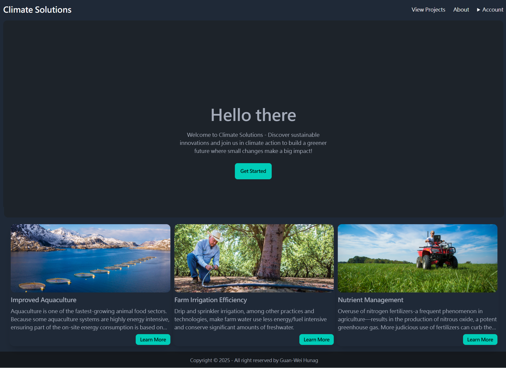
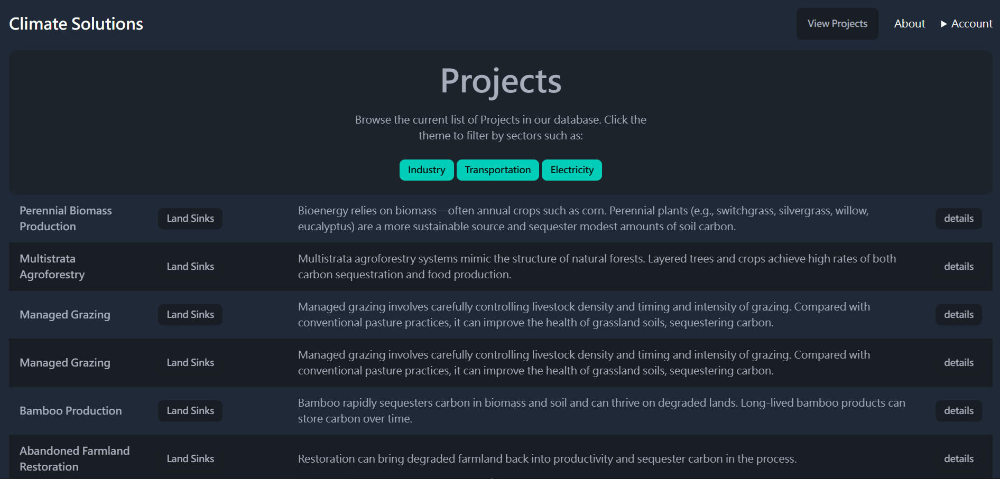
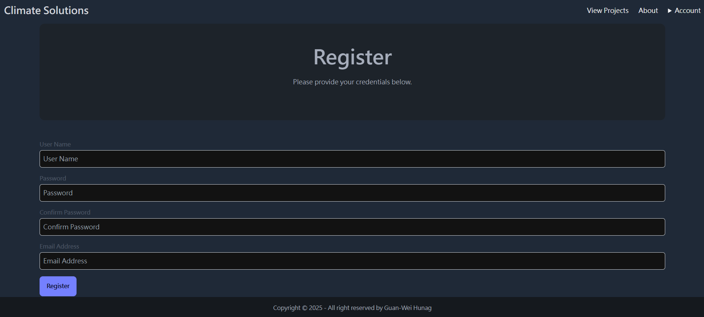
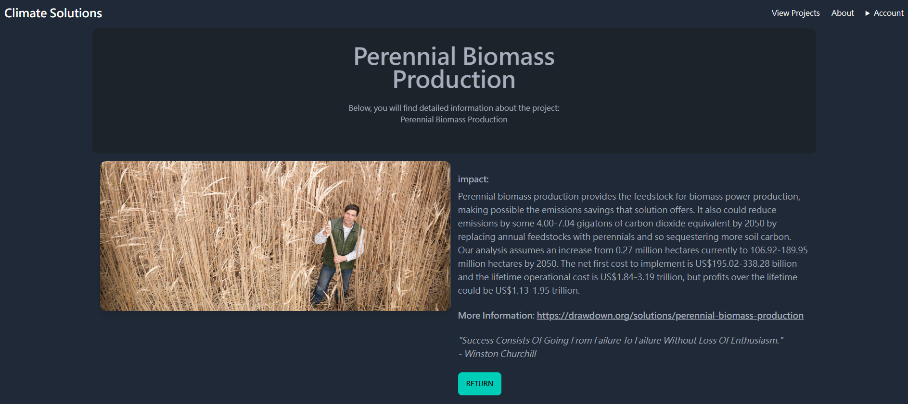

# Interactive-Project-Viewer-App

An interactive full-stack web application for browsing and managing categorized projects. This app allows authenticated users to filter projects by sector, view project details, and perform full CRUD operations.

## 🔧 Tech Stack

- **Backend**: Node.js, Express.js  
- **Frontend**: EJS (Embedded JavaScript Templates), Tailwind CSS  
- **Authentication**: MongoDB  
- **Database (Projects)**: Neon (PostgreSQL) + Sequelize ORM  
- **Session Management**: client-sessions  
- **Deployment Ready**: Works with platforms like Render, Railway, or Cyclic

---

## 🚀 Features

- User registration and login (MongoDB-based authentication)
- Sector-based project filtering and display
- Full project CRUD (Create, Read, Update, Delete)
- Session-based user authentication (only logged-in users can edit/delete)
- Clean and responsive UI with Tailwind CSS
- Error handling pages (404, 500)

---

## 📸 Screenshots

Home:


Projects Table:


Register Form:


Project page:


---

## 📁 Project Structure

```
  plaintext
  ├── views/                 # EJS Templates
  ├── public/                # Static assets (CSS, JS, images)
  ├── modules/
  │   ├── projects.js        # Sequelize models and DB logic
  │   └── auth-service.js    # MongoDB user auth logic
  ├── .env                   # Environment variables
  ├── server.js              # Main Express server
  ├── package.json
```
##🔑 Environment Variables (.env)
Make sure to create a .env file with the following:

```
  PG_CONNECTION_STRING=your_postgres_connection_url
  MONGO_CONNECTION_STRING=your_mongo_connection_url
```

##🛠️ Installation

```
  # Clone the repo
  git clone https://github.com/your-username/Interactive-Project-Viewer-App.git
  cd Interactive-Project-Viewer-App
  
  # Install dependencies
  npm install
  
  # Create .env file and fill in your DB credentials
  touch .env
  
  # Run the app
  npm start
```
Then visit: http://localhost:3000

##📄 License
This project is licensed under the MIT License.


## 🙋 Contributors

- **Guan-Wei Huang**  
For questions or suggestions, feel free to contact:  
Email: gwhuang24@gmail.com